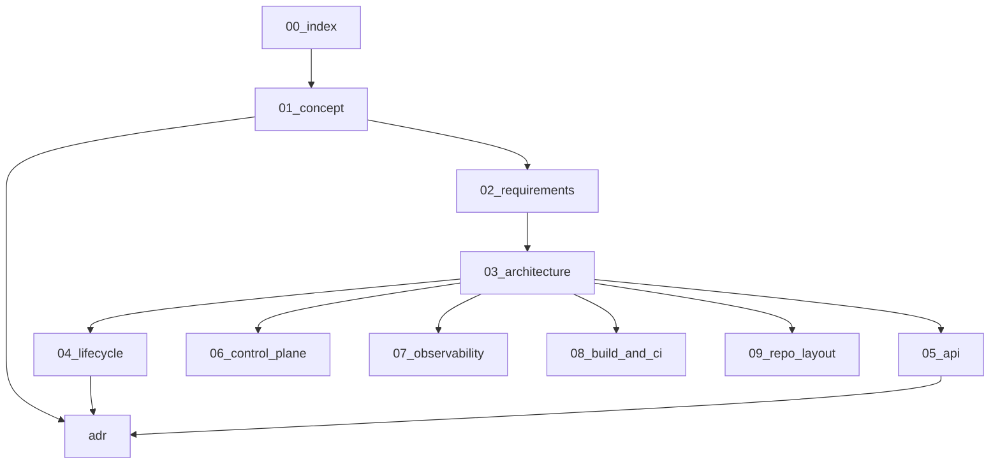

# Documentation index

Read in order. Later documents assume earlier decisions.

## Map

| File | Depends on | Produces |
|------|------------|----------|
| [01-concept.md](01-concept.md) | — | Roles, boundaries, vocabulary |
| [02-requirements.md](02-requirements.md) | 01 | FR/NFR, non-goals, SLOs |
| [03-architecture.md](03-architecture.md) | 01–02 | Process, packages, flows |
| [04-lifecycle.md](04-lifecycle.md) | 02–03 | State machine, apply/rollback |
| [05-api.md](05-api.md) | 02–04 | REST v1 surface |
| [06-control-plane.md](06-control-plane.md) | 02–05 | Push/pull, identity, auth |
| [07-observability.md](07-observability.md) | 02–05 | Logs, metrics, health |
| [08-build-and-ci.md](08-build-and-ci.md) | 02–03 | Build tags, CI, size |
| [09-repo-layout.md](09-repo-layout.md) | 03–08 | Directory / package map |
| [adr/](adr/) | 01–06 | Locked decisions |

## Quality bar vs panel monoliths

Reference panels (including s-ui) show that in-process `singbox.New` is viable. They are **not** the quality target for this agent. This project requires:

- management plane isolated from box failures;
- last-good atomic swap on apply;
- typed status/revision contracts;
- slim server-oriented build profile;
- explicit observability and ADRs.

See ADRs for the locked choices.
