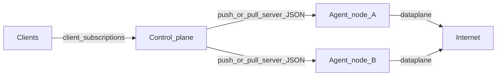

# 01 — Concept

## One-line

**sing-box-subserver** is a remote edge agent: a single OS process that runs one sing-box dataplane instance and a management REST API, controlled by a mother control plane (commonly s-ui) but **independent** as a codebase and deployable artifact.

## Roles

| Role | Owns | Does not own |
|------|------|----------------|
| **External control plane** (s-ui / equivalent) | Node inventory, desired server configs, client accounts, multi-server client subscriptions, UI | Packet forwarding on the edge |
| **Edge agent** (this project) | Local last-good config, box lifecycle, status/metrics/logs API, optional pull / direct push | Billing; panel UI; (by default) client CRUD |
| **Optional embedded controlplane** (`with_controlplane`) | Local users, protocol presets, demux inbound sets, per-user subscription URLs, materialize → Apply | Traffic accounting counters (future module); s-ui inventory |

## Vocabulary

| Term | Meaning |
|------|---------|
| **Box** | In-process sing-box instance (`singbox.New` → `Start` / `Close`) |
| **Management plane** | HTTP API + supervisor + config store; must survive box death |
| **Dataplane** | Active box serving inbounds / WireGuard endpoints |
| **Desired config** | Server-side sing-box JSON the active **config owner** wants on the node |
| **Config owner** / **`config_mode`** | Exclusive writer of desired config: `idle` \| `subscribed` \| `direct` \| `controlplane` ([ADR 0008](adr/0008-exclusive-config-owner.md)) |
| **Last-good** | Last config that successfully started and passed health probe |
| **Staged** | Candidate config being validated / started before swap |
| **Revision** | Monotonic or content-addressed identifier for a config generation |
| **Node ID** | Stable agent identity registered with the control plane |
| **Agent Bearer** | Ops token for `/v1/*` management (bootstrap or managed) |
| **User sub token** | Opaque token in a public subscription URL (controlplane module only) |

## Product principles

1. **Lightweight overlay** — API and supervisor stay thin; cost is dominated by sing-box and traffic, not the agent framework.
2. **Fail closed on apply, fail open on management** — bad config does not take down HTTP or wipe last-good; dead box does not take down HTTP.
3. **One box per process** — no multi-tenant boxes in v1; horizontal scale = more nodes.
4. **Server profile** — agent is for **server** configs (inbounds + WireGuard endpoints), not client TUN desktops or Clash dashboards ([ADR 0006](adr/0006-no-clash-api.md)).
5. **Independence** — no import of panel packages; contracts are HTTP + JSON only.

## Boundary with s-ui

s-ui (or any mother panel) may:

- deploy the agent over SSH once (binary + systemd + token);
- `PUT /v1/config` with generated **server** JSON;
- expose a desired-config URL for agent pull;
- aggregate **client** subscriptions that point at many nodes.

The agent must not:

- embed panel UI or import panel packages;
- require the panel at compile time ([ADR 0004](adr/0004-independent-of-sui.md)).

Optional module [`docs/controlplane/`](controlplane/00-index.md) (`with_controlplane`) **may** own local users and per-user subscription URLs **on the agent itself**, as an exclusive `config_mode=controlplane` alternative to external push/pull — not as a merge with s-ui.

## Gaps this project closes vs typical panel monoliths

| Typical panel core | This agent |
|--------------------|------------|
| Restart often stops then starts; failed start can leave dataplane down | Atomic swap + last-good keep |
| Management and box share fate in practice | Explicit isolation: API always serves status |
| Informal “isRunning” bool | Versioned status machine + revision |
| Fat binary (UI, many tags) | Slim server tag allowlist |
| No formal agent identity / pull | Node ID, push + scheduled pull |

## Success picture

An operator (or s-ui) can:

1. Bootstrap agent on a VPS.
2. Push a server config; agent reports `Running` + revision.
3. Push a broken config; agent keeps previous dataplane, returns error with details.
4. Kill/crash the box path; agent marks `Degraded`/`Stopped`, restarts last-good with backoff, management API stays reachable.
5. Lose connectivity to the panel; running dataplane continues; pull retries without thrashing.
