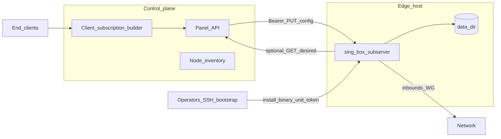
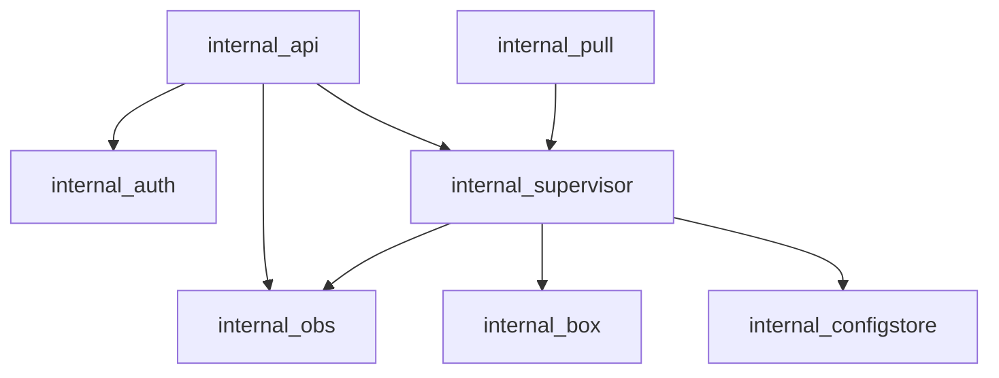
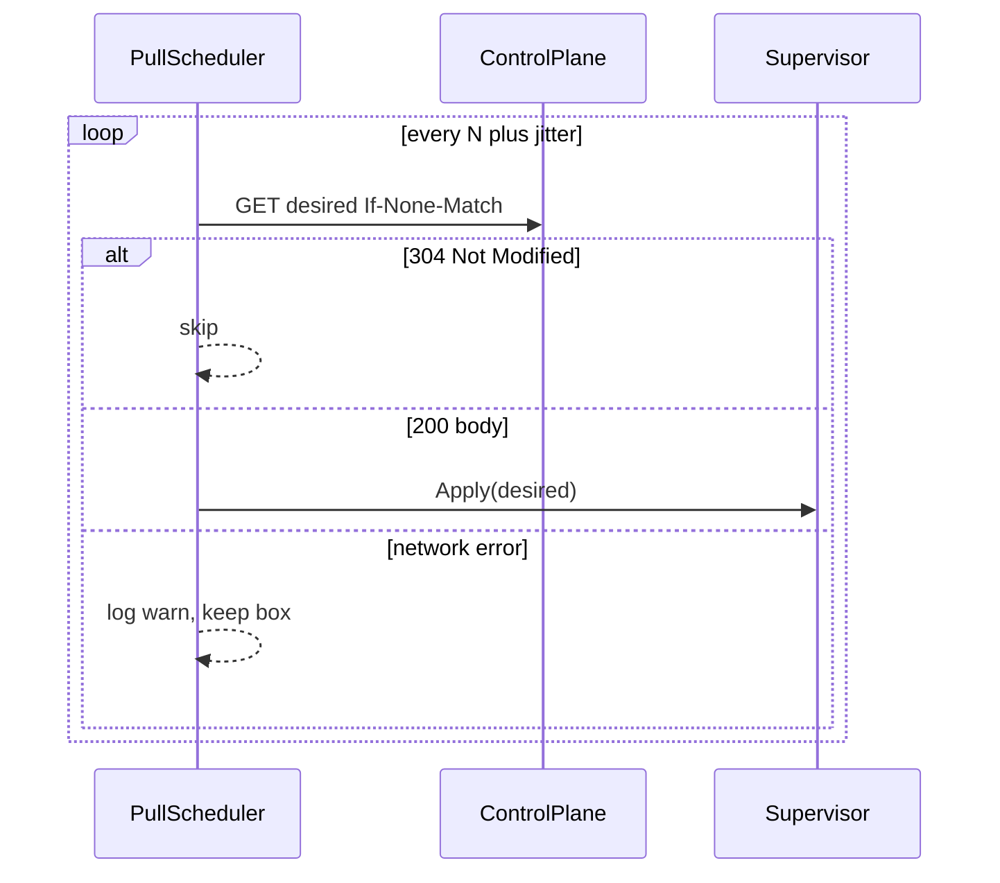

# 03 — Architecture

## System context



## Process model

One OS process:

1. **HTTP server** — management REST (`internal/api`).
2. **Supervisor** — owns box pointer, apply mutex, state machine (`internal/supervisor`).
3. **Config store** — staged / last-good / meta on disk (`internal/configstore`).
4. **Pull scheduler** — optional timer (`internal/pull`).
5. **Observability** — log ring, metrics registry (`internal/obs`).
6. **Box adapter** — thin wrap over sing-box-lx (`internal/box`).



## Package responsibilities

| Package | Responsibility |
|---------|----------------|
| `cmd/subserver` | `main`, signal handling, wire dependencies |
| `internal/app` | Composition root / run loop |
| `internal/api` | HTTP routes, request validation, response envelopes |
| `internal/auth` | Bearer token compare (constant-time) |
| `internal/supervisor` | State machine, apply pipeline, crash watch, backoff |
| `internal/configstore` | Atomic file writes, revisions, last-good / staged |
| `internal/box` | Build registries (server tags), `New`/`Start`/`Close`, health probe hooks |
| `internal/pull` | HTTP client to mother desired-config URL |
| `internal/obs` | slog setup, ring buffer, Prometheus + JSON metrics |
| `internal/agentcfg` | Agent YAML/JSON settings (not sing-box JSON) |
| `internal/controlplane` | Optional (`with_controlplane`): local users, presets, sets, materialize, `/v1/sub/{token}` — see [controlplane/](controlplane/00-index.md) |

## Config ownership

Exactly one writer owns desired-config updates at a time:
`idle` | `subscribed` | `direct` | `controlplane` ([ADR 0008](adr/0008-exclusive-config-owner.md)).
Push, subscribe, and controlplane Claim through a shared owner registry; all Applies go through `supervisor`.


## Data flow — push apply

```mermaid
sequenceDiagram
  participant CP as ControlPlane
  participant API as MgmtAPI
  participant Sup as Supervisor
  participant Store as ConfigStore
  participant Box as BoxAdapter
  CP->>API: PUT /v1/config
  API->>Sup: Apply(desired)
  Sup->>Sup: Validate unmarshal
  Sup->>Store: WriteStaged
  Sup->>Box: Close old
  Sup->>Box: New+Start staged
  alt health OK
    Sup->>Store: PromoteLastGood
    Sup-->>API: Running revision
  else fail
    Sup->>Box: New+Start last_good
    Sup-->>API: error plus restored
  end
  API-->>CP: JSON status
```

## Data flow — pull



## Concurrency model

- **Single apply mutex** — push and pull serialize through supervisor.
- **Status reads** — lock-free or RLock snapshot of immutable status struct.
- **Box pointer** — `atomic.Pointer` (or mutex) swapped only after successful start+probe.
- **HTTP** — standard net/http or chi/Gin; no business logic in handlers beyond DTO mapping.

## Dependency on sing-box

- Module pin / replace to **sing-box-lx** (same family as s-ui).
- `internal/box` registers **server** inbound/outbound/endpoint registries via build tags ([08-build-and-ci](08-build-and-ci.md)).
- Panel trackers/UI clash API are **out of scope** unless explicitly needed later for metrics.

## Trust boundaries

| Boundary | Trust |
|----------|--------|
| Dataplane listeners | Untrusted internet |
| Management API | Trusted control plane / operator only (token + bind/TLS policy) |
| Public `/v1/sub/{token}` (optional CP) | Anyone with the user token; no agent Bearer |
| Data dir | Local root/agent user; secrets (token) file mode 0600 |

## Evolution hooks (not v1)

- mTLS client certs for management.
- Sidecar metrics remote write.
- Canary dual-box traffic shift (still one process, advanced).
- Traffic accounting module consuming controlplane user hooks.
