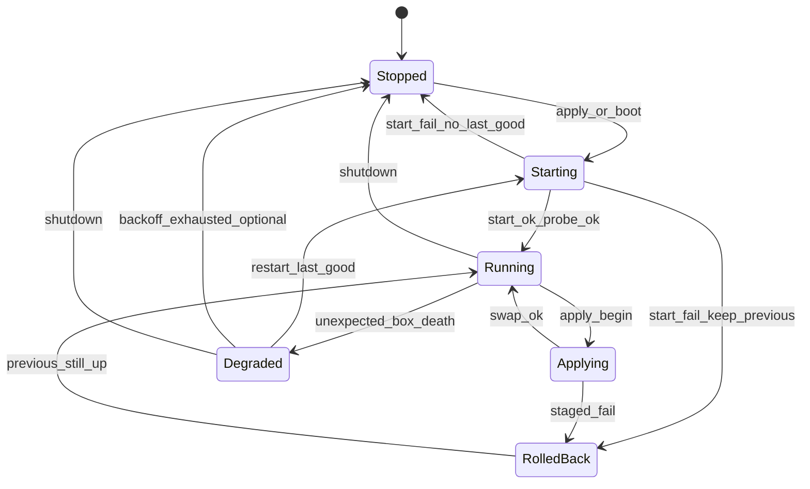

# 04 — Lifecycle

## State machine

| State | Management API | Dataplane |
|-------|----------------|-----------|
| `Stopped` | up | none |
| `Starting` | up | starting staged or last-good |
| `Running` | up | active last-good |
| `Applying` | up (status shows applying) | old still serving until swap |
| `Degraded` | up | down or restarting |
| `RolledBack` | up | previous revision still active; last apply failed |

`RolledBack` may immediately present as `Running` with `last_apply_status=failed` in the status payload. The important part is **not** losing the previous box.

## Boot sequence

1. Load agent settings.
2. Init obs + API (listen).
3. If last-good exists on disk → apply as boot start (same pipeline, no previous box).
4. Start pull scheduler if configured.
5. Block on signals.

If boot start fails → remain `Stopped`, serve API with `last_error`, do not exit (unless `--exit-on-boot-failure` for crashloop debugging).

## Apply pipeline (normative)

Serialized under supervisor mutex.

**Bind reality:** server inbounds/endpoints use exclusive listen ports, so two boxes cannot both `Start` on the same ports. Reliability is achieved by **disk last-good + immediate restore**, not by dual-running instances.

1. **Admit** — auth already done; parse body; reject empty; optional `If-Match` vs current revision.
2. **Validate** — `option.Options` unmarshal in a throwaway context / dry registry; reject unknown required tags with clear error. **No listen yet.** On validate fail → return `4xx`, previous box untouched.
3. **Stage** — write `staged.json` + `staged.meta` (sha256, timestamp, source=push|pull) via temp + rename.
4. **Quiesce old** — `Close` current box (dataplane briefly down). Persist that last-good files remain intact on disk.
5. **Start staged** — `New` + `Start` from staged. On failure → **immediately** `New`+`Start` from **last-good** files; set `last_error`; state `RolledBack`/`Running` with failed apply; metric `rollback_total`.
6. **Probe** — Start success + brief settle; on probe fail → same restore-from-last-good path as step 5.
7. **Promote** — only after success: rename staged → last-good; bump revision; `apply_total{result="ok"}`.
8. **Watch** — bind crash waiter to the new instance.

Idempotent same-hash apply may skip steps 4–7.

## Crash detection

- Supervisor holds `done` channel / context cancel from box runtime if available; otherwise poll `Alive()` / wait group.
- On unexpected death while state was `Running`:
  - transition `Degraded`;
  - `box_restarts` metric;
  - restart from **last-good** with exponential backoff (e.g. 1s → 2s → … cap 60s) + jitter;
  - after N failures, stay `Degraded` and require manual apply or longer backoff (configurable).

## Rollback semantics

| Event | Action |
|-------|--------|
| Staged `New`/`Start` fails | Close staged; keep old; status error |
| Probe fails | Close staged; keep old |
| Post-swap crash inside grace window (optional v1.1) | Restart last-good; mark rollback |
| Pull returns garbage | Same as failed apply; do not flip revision |

**Never** delete last-good because staged failed.

## Revision model

- `content_sha256` — hash of canonical JSON bytes as received (or normalized).
- `revision` — monotonic uint64 stored in meta, incremented on successful promote.
- Idempotent apply: if `content_sha256` equals current and box `Running` → `200` no-op (optional short-circuit before stage).

## Concurrency and backpressure

- Second apply while `Applying` → `409 Conflict` with current state.
- Shutdown waits for apply to finish or cancels staged start with deadline.

## Comparison to naive Stop/Start panels

Naive flow `StopCore → StartCore` loses dataplane if Start fails **and** often lacks durable last-good restore. This agent always keeps last-good on disk, validates before stop, and **restores last-good immediately** if the new start fails ([ADR 0003](adr/0003-last-good-config.md)).
