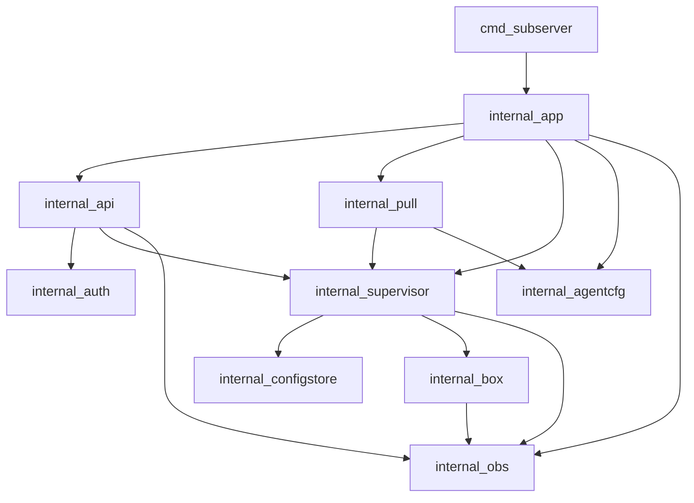

# 09 — Repository layout

Target layout for implementation (docs phase creates `docs/` + `README` only; packages appear next).

```
sing-box-subserver/
  README.md
  docs/                          # architecture ladder (this tree)
  openapi/                       # openapi.yaml (with API impl)
  cmd/
    subserver/
      main.go
  internal/
    app/                         # run, wire, shutdown
    agentcfg/                    # agent settings load/validate
    api/                         # HTTP handlers / router
    auth/                        # bearer
    supervisor/                  # state machine, apply, watch
    configstore/                 # staged / last-good / meta
    box/                         # sing-box registries + lifecycle
    pull/                        # mother pull scheduler
    obs/                         # slog, ring, metrics
  build/
    tags.server                  # allowlisted -tags
  deploy/
    subserver.service            # systemd example
    agent.example.yaml
  scripts/
    smoke_local.sh               # later
  go.mod
  go.sum
  .github/workflows/ci.yml
```

## Package dependency rules



Rules:

- `internal/box` must not import `api` or `pull`.
- `api` must not start boxes directly — only via `supervisor`.
- No imports from s-ui modules.

## Data directory layout (runtime)

```
/var/lib/subserver/
  last-good.json
  last-good.meta.json
  staged.json
  staged.meta.json
  agent-state.json          # revision counter, etc.
```

Writes: temp file in same dir + `rename` for atomicity.

## Coding standards (preview)

- Context on all I/O; timeouts on pull/heartbeat.
- Typed errors (`errors.Is` / codes mapped to API).
- No global mutable box pointer outside supervisor.
- Table-driven tests for apply rollback and auth.
