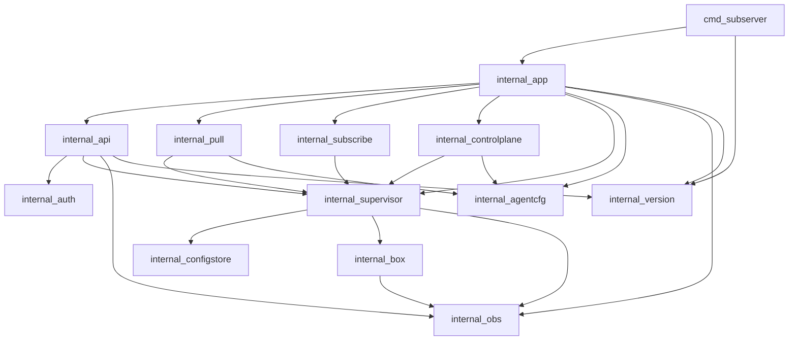

# 09 — Repository layout

```
sing-box-subserver/
  README.md
  CONTRIBUTING.md
  docs/                          # architecture ladder
  docs/controlplane/             # optional embedded CP docs
  openapi/                       # openapi.yaml (with API impl)
  cmd/
    subserver/
      main.go
  internal/
    app/                         # run, wire, shutdown
    agentcfg/                    # agent settings load/validate
    api/                         # HTTP handlers / router
    auth/                        # bearer
    supervisor/                  # state machine, apply, watch
    configstore/                 # staged / last-good / meta
    box/                         # sing-box registries + lifecycle
    version/                     # agent + sing-box version helpers
    pull/                        # mother pull scheduler (legacy)
    subscribe/                   # runtime pull/subscribe manager
    heartbeat/                   # optional status push
    controlplane/                # optional with_controlplane module
    obs/                         # slog, ring, metrics
  third_party/
    sing-box-lx/                 # git submodule (same family as s-ui)
  build/
    tags.server                  # allowlisted -tags (default; no CP)
    tags.server.controlplane     # optional: server + with_controlplane
  deploy/
    subserver.service            # systemd example
    agent.example.yaml
  scripts/
    smoke_local.sh               # later
  go.mod
  go.sum
  .go-version
  .github/workflows/ci.yml
```

## Package dependency rules



Rules:

- `internal/box` must not import `api`, `pull`, `subscribe`, or `controlplane`.
- `api` must not start boxes directly — only via `supervisor`.
- `controlplane` Applies only via `supervisor`; must not import s-ui.
- No imports from s-ui modules.
- `third_party/sing-box-lx` is the only sing-box source (`replace` in `go.mod`).
- `with_controlplane` is compile-optional; see [controlplane/09-build-and-ci](controlplane/09-build-and-ci.md).

## Data directory layout (runtime)

```
/var/lib/subserver/
  last-good.json
  last-good.meta.json
  staged.json
  staged.meta.json
  agent-state.json          # revision counter, etc.
  subscribe-state.json
  heartbeat-state.json
  credentials.json
  controlplane/             # only when module used
    users.json
    sets.json
    state.json
```

Writes: temp file in same dir + `rename` for atomicity.

## Coding standards

See [10-repo-culture](10-repo-culture.md). Preview:

- Context on all I/O; timeouts on pull/heartbeat.
- Typed errors (`errors.Is` / codes mapped to API).
- No global mutable box pointer outside supervisor.
- Table-driven tests for apply rollback and auth.
- `gofmt` / `go vet` clean; conventional commits.
