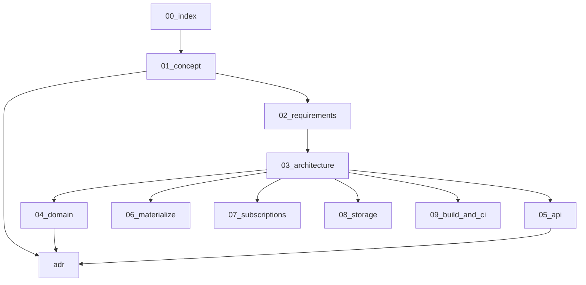

# Controlplane module — documentation index

Optional in-process control plane for **sing-box-subserver**: local users, protocol presets,
demux inbound sets, subscription URLs, and materialize → `supervisor.Apply`.

Build tag: **`with_controlplane`**. Default CI / `build/tags.server` **omit** the tag
([09-build-and-ci](09-build-and-ci.md), [ADR 0001](adr/0001-optional-build-tag.md)).

Root agent docs remain authoritative for lifecycle, auth tokens, and exclusive
`config_mode` ([ADR 0008](../adr/0008-exclusive-config-owner.md)). This ladder owns
only the embedded module.

## Map

| File | Depends on | Produces |
|------|------------|----------|
| [01-concept.md](01-concept.md) | root 01, ADR 0008 | Roles, boundaries, vocabulary |
| [02-requirements.md](02-requirements.md) | 01 | FR/NFR, non-goals |
| [03-architecture.md](03-architecture.md) | 01–02 | Packages, flows, dep rules |
| [04-domain.md](04-domain.md) | 02–03 | Users, presets, sets, hooks |
| [05-api.md](05-api.md) | 02–04 | REST surface |
| [06-materialize.md](06-materialize.md) | 03–04 | Server JSON build + Apply |
| [07-subscriptions.md](07-subscriptions.md) | 04–05 | Public sub URL contract |
| [08-storage.md](08-storage.md) | 03–04 | JSON files under data_dir |
| [09-build-and-ci.md](09-build-and-ci.md) | 03 | Tag, stubs, CI matrix |
| [10-scenarios.md](10-scenarios.md) | 05–07 | Operator happy paths |
| [11-tls.md](11-tls.md) | 04–06 | TLS profiles (self-signed / ACME) |
| [adr/](adr/) | 01–08 | Locked module decisions |

## Read order

1. Concept → requirements → architecture  
2. Domain (invariants) before API  
3. Materialize + subscriptions + storage  
4. Build/CI last  

Implementation must not precede accepted docs in this tree ([root culture](../10-repo-culture.md)).
