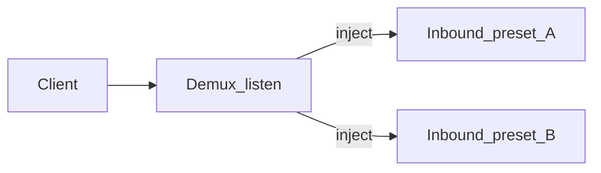

# 01 — Concept (controlplane)

## One-line

**controlplane** is an optional module inside the edge agent that turns a standalone
subserver into a tiny local control plane: named protocol presets, demux-backed inbound
sets on one public port, local users with per-preset credentials, and per-user
subscription URLs — without s-ui and without merging into subscribe/direct modes.

## Why

VPN clients typically consume **outbounds/endpoints** from a subscription, not the full
routing/DNS policy surface of a heavy panel. An operator who wants a single edge node
with multi-user access should not need the panel monolith. The agent already has
management REST, last-good apply, and demux (`with_demux`); this module adds the missing
local product surface behind `with_controlplane`.

## Roles

| Role | Owns |
|------|------|
| **Agent core** | Box lifecycle, last-good, Bearer auth, exclusive `config_mode` registry |
| **controlplane module** | Users, presets, inbound sets, materialize, public `/v1/sub/{token}` |
| **External panel** (optional, separate deploy) | Unrelated; no compile-time link ([ADR 0004](../adr/0004-independent-of-sui.md)) |
| **Future traffic module** | Counters / enforcement signals; plugs into user hook fields |

## Boundaries

- **Exclusive mode.** Activating a set sets `config_mode=controlplane` and **cancels**
  subscribe; `PUT /v1/config` / `POST /v1/subscribe` **deactivate** controlplane ownership
  ([root ADR 0008](../adr/0008-exclusive-config-owner.md), [module ADR 0002](adr/0002-exclusive-config-owner.md)).
- **No merge** with pushed or pulled JSON. Materialize always emits a full server config.
- **Two auth planes:**
  - Agent Bearer → `/v1/controlplane/*` (ops CRUD / activate).
  - User `sub_token` in URL path → `GET /v1/sub/{token}` (client fetch only).
- **Not a second panel:** no UI, no SQLite, no multi-node inventory, no Clash API.

## Vocabulary

| Term | Meaning |
|------|---------|
| **Protocol preset** | Named inbound+outbound JSON templates + traits + description |
| **Inbound set** | Named ordered list of presets + listen + demux template for **one** port |
| **Active set** | At most one set whose materialize currently owns the box (when mode=controlplane) |
| **Local user** | Agent-local account; static per-preset creds; optional expiry / traffic hooks |
| **Traits** | Declared connection characteristics (tcp/udp/h2/h3/…) used when authoring demux rules |
| **Materialize** | Build full sing-box server JSON from active set + eligible users → Apply |
| **Sub token** | Secret path segment for the user's public subscription URL |

## Demux sets (product picture)

An **inbound set** binds one or more protocol variants on a single public listen.
Demux template is **optional**: with demux, rules match sniffed traits and inject into
in-process inbounds; without demux, exactly one preset binds the port directly.

Many sets may be **active** on **different** ports at once. A second set on the same
`listen_port` is refused (`409`).

## Success picture

1. Build agent with `with_controlplane` (+ `with_demux` if sets use demux).
2. Create users via API → creds auto-generated for all known presets.
3. Define/select an inbound set; activate → `config_mode=controlplane`, box hot-applies.
4. Client opens `GET /v1/sub/{token}` → outbounds for that user.
5. User expires or hits traffic limit hook → creds omitted on next materialize + Apply.
6. Operator switches to panel pull → subscribe wins; controlplane ownership cleared.
