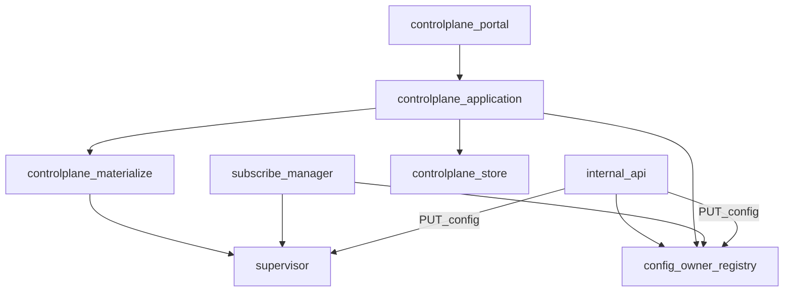
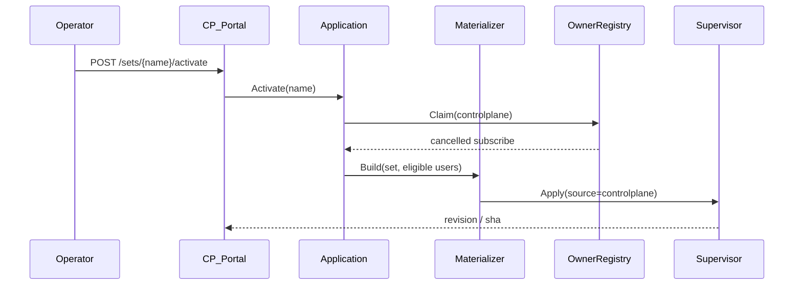

# 03 — Architecture (controlplane)

## Placement in the agent



The module never starts boxes directly — only `supervisor.Apply`, same as push/subscribe.

## Package layout (target)

```
internal/controlplane/
  module.go              # New(deps) — build-tagged entry
  module_stub.go         # !with_controlplane → nil service
  domain/                # types, eligibility, errors
  store/                 # JSON load/save under data_dir/controlplane/
  application/           # users, sets, activate, expiry loop
  materialize/           # presets + set + users → []byte JSON
  subscribe/             # render public subscription body
  portal/                # HTTP: /v1/controlplane/*, /v1/sub/{token}
  presets/               # embed FS of preset JSON files
```

### Dependency rules

| May import | Must not import |
|------------|-----------------|
| `internal/supervisor` (Apply only) | s-ui / panel modules |
| `internal/agentcfg` (public_host, data_dir) | `internal/box` (no registry coupling) |
| `internal/obs` (optional logging) | `internal/subscribe` as a library cycle — coordinate via owner registry in `app` |
| stdlib, small helpers | |

`internal/api` mounts handlers from `portal` when the service is non-nil (same pattern as Subscribe/Heartbeat fields today).

`internal/app` wires: construct CP service → register owner callbacks → pass to API.

## Config owner integration

Shared registry (root concern, used by CP):

- `Owner() config_mode`
- `Claim(mode, reason)` with documented side effects
- Subscribe cancel, CP deactivate hooks registered at wire time

See [root ADR 0008](../adr/0008-exclusive-config-owner.md) and [module ADR 0002](adr/0002-exclusive-config-owner.md).

## Runtime flows

### Activate set



### User becomes ineligible

Expiry ticker (or traffic signal) → recompute eligible set → if active set and SHA changed → Apply.

### Public subscription

`GET /v1/sub/{token}` → lookup user by token → eligibility check → render outbounds from presets (filter query) → response. Does **not** call Apply.

## Agent settings (seed)

Optional YAML section (names normative for implementation):

```yaml
controlplane:
  public_host: "203.0.113.10"   # or hostname for outbound templates
  public_port: 443             # default listen advertised in subs if set omits
  expiry_tick_sec: 60
```

Listen for demux/inbounds comes primarily from the **set** definition; `public_host` is for client-facing outbound address.

## Isolation from subscribe / direct

| Concern | Behavior |
|---------|----------|
| Data | CP state only under `data_dir/controlplane/`; does not read subscribe-state as input |
| Schedule | Claim(controlplane) stops subscribe timer |
| Push | PUT config Claims(direct) and clears CP `active_sets` via leave hook |
| Last-good | Shared artifact; overwritten wholly on each successful Apply |
| Active sets | Many sets may be active on different ports; materialize merges all |
