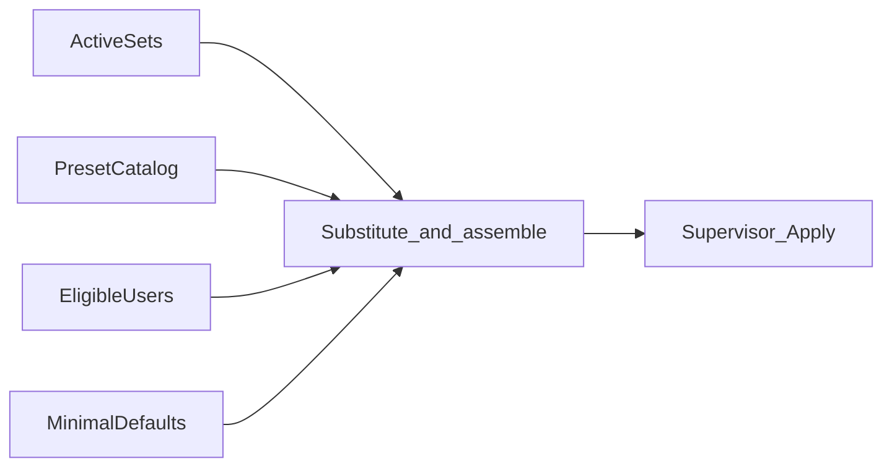

# 06 — Materialize (controlplane)

## Goal

Produce a **complete** server-side sing-box JSON document from:

- **all** `active_sets`
- embedded `ProtocolPreset`s referenced by those sets
- **eligible** local users
- agent `controlplane.public_host`

Then `supervisor.Apply` with `source=controlplane`.

## Pipeline

## Assembly order

1. `log` — level from agent default or fixed `warn`.
2. For each active set (stable name sort for determinism):
   - If `demux_template` present: demux inbound on set listen/port; protocol inbounds inject-only (no public bind conflict).
   - If demux null: single protocol inbound binds set listen/port.
3. Attach `users[]` on each protocol inbound from eligible users' `creds[preset]` (lazy backfill first).
4. `outbounds` — at least `direct` (and `block` if required by route).
5. `route` / `dns` — minimal defaults so validate succeeds.
6. If TLS profile mode is `acme_*`: emit `certificate_providers` with tag `cp-tls`.
7. Attach TLS to each TLS-capable inbound (`certificate_path`/`key_path` or `certificate_provider`) — see [11-tls](11-tls.md).
8. Omit Clash experimental; omit panel-only objects.

Exact default dns/route JSON is fixed in implementation tests as golden files.

## Idempotency

Canonical JSON bytes → SHA-256. If equal to last-good / last materialize and box up → Apply noop.

## Triggers

| Event | Rematerialize if any active set |
|-------|--------------------------------|
| User create/update/delete affecting eligibility or creds | yes |
| Token rotate | no (sub only) |
| Creds rotate | yes |
| Set create | no |
| Set update while that set active | yes |
| Activate | yes |
| Deactivate (remaining active) | yes |
| Deactivate (none left) | Claim(idle); no Apply required |
| Expiry / traffic reset tick | yes if eligibility set changed |
| TLS profile PUT (mode/spec change) | yes; Force reload if PEM rewritten or mode switched |
| TLS POST regenerate (self_signed) | yes; Force reload (paths unchanged but PEM bytes new) |

## Failure behavior

Validate/Apply errors surface to activate/PATCH callers; previous last-good remains (root lifecycle). If Apply fails after Claim(controlplane), **keep claim**, leave box on previous last-good, return error (operator retries).

## Relation to demux

Requires sing-box-lx demux inject (SPEC 037) when templates include demux. Activate without demux works with server tags alone.
