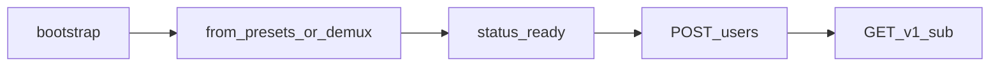

# Controlplane API — modular guide

Operator-facing REST under `/v1/controlplane/*` (Bearer agent token) plus public
`GET /v1/sub/{token}`. This tree is the **how-to / contract** layer; the endpoint
catalog remains in [../05-api.md](../05-api.md).

## Modules

| Doc | Audience | Covers |
|-----|----------|--------|
| [01-auth-and-envelopes](01-auth-and-envelopes.md) | All | Bearer vs path token; `{ok,data}` vs raw sub |
| [02-bootstrap-and-ready](02-bootstrap-and-ready.md) | Wizard / SDK | `client/bootstrap`, `status.ready` |
| [03-catalog](03-catalog.md) | Install UI | protocols, presets, demux-groups, ports |
| [04-sets-lifecycle](04-sets-lifecycle.md) | Install UI | from-*, activate, replace, errors |
| [05-users-subscription](05-users-subscription.md) | Clients | users, filters, merge contract |
| [06-tls-acme-reality](06-tls-acme-reality.md) | Ops | SSL profiles, Reality pool |
| [07-errors-and-contracts](07-errors-and-contracts.md) | Integrators | Stable `error.code` map |

## Scenarios (end-to-end)

Runnable flows with **pytest anchors** live in [../scenarios/00-index.md](../scenarios/00-index.md).

## Live verification

| Suite | Path |
|-------|------|
| VPS controlplane | [`tests/vps_cp/`](../../../tests/vps_cp/README.md) |
| Unit (Go) | `go test ./internal/controlplane/... -tags with_controlplane,with_demux` |

Default live base used by CI artifacts: `https://$CP_BASE` with `CP_INSECURE=1` for self-signed management TLS.
