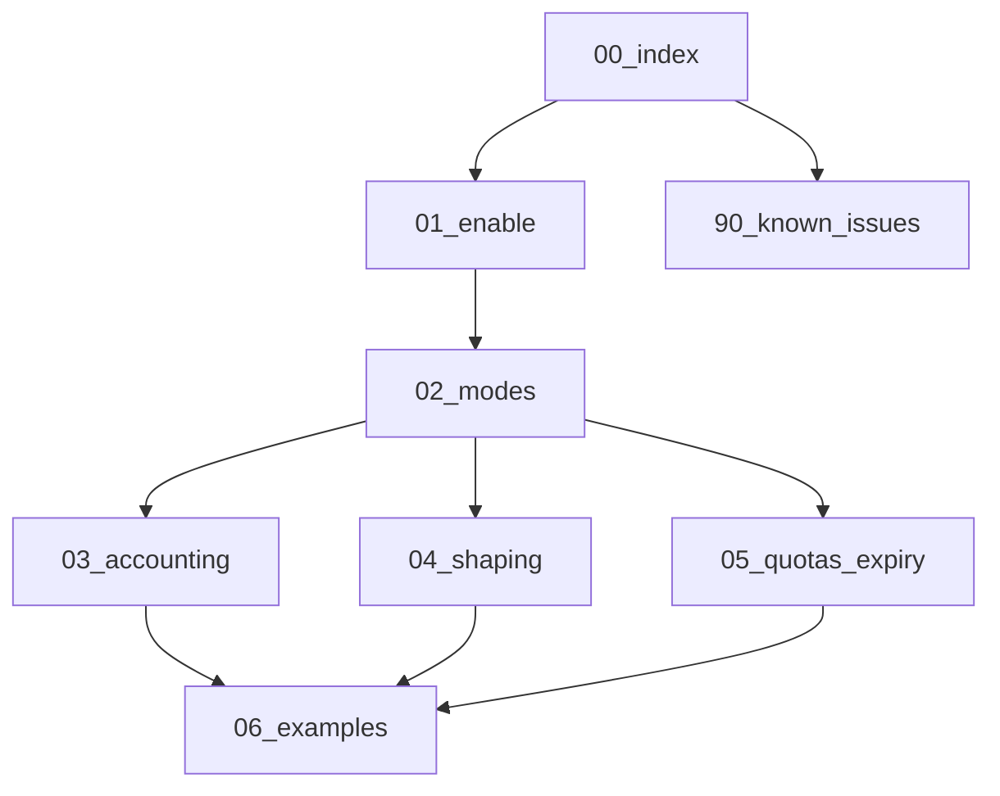

# Traffic guides (operator)

How to enable and operate accounting, shaping, quotas, and expiry on an agent
built with **`with_traffic`**.

This tree is **operator documentation**. Implementation contracts live under
[`docs/traffic/`](../../traffic/00-index.md) and must not be duplicated here.



| File | Content |
|------|---------|
| [01-enable.md](01-enable.md) | Build tags, `agent.yaml`, verify `/v1/traffic/status` |
| [02-modes.md](02-modes.md) | Controlplane vs subscribe vs static |
| [03-accounting.md](03-accounting.md) | Subjects, stats, onlines, inject |
| [04-shaping.md](04-shaping.md) | Layers, keys, PUT limits, live unthrottle |
| [05-quotas-and-expiry.md](05-quotas-and-expiry.md) | CP `traffic_limit_*`, `expires_at`, kick |
| [06-examples.md](06-examples.md) | Copy-paste YAML / curl recipes |
| [90-known-issues.md](90-known-issues.md) | Deferred / investigate later |

## Smoke

Local multi-mode matrix (Docker + VLESS):

```bash
# from repo root of sing-box-subserver
powershell -File scripts/traffic_modes_docker.ps1
# or: SKIP_IPERF=1 to skip real transfers; KEEP_UP=1 to leave compose up
```
