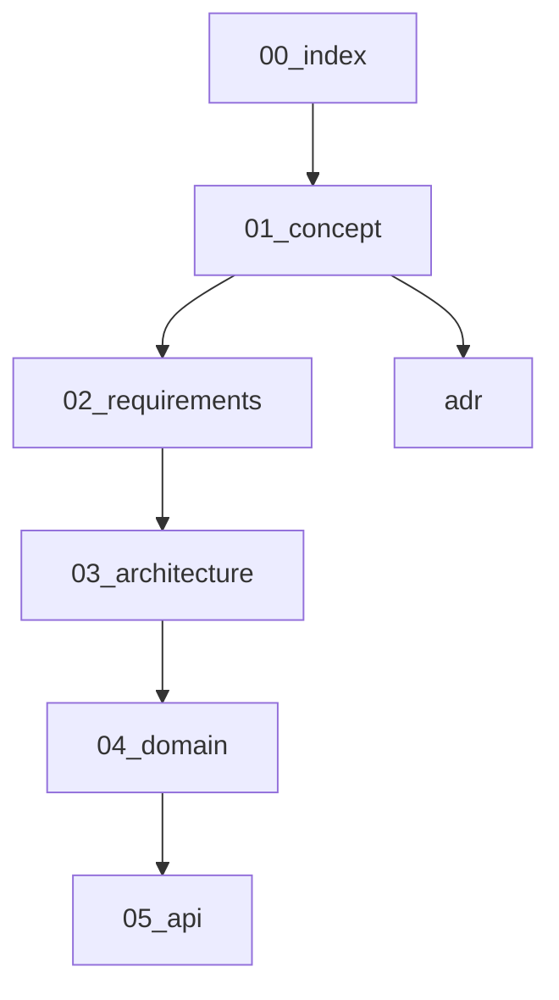

# Traffic module documentation

Optional dataplane accounting and shaping for sing-box-subserver.
Build tag: **`with_traffic`** (omit from default [`build/tags.server`](../../build/tags.server)).

| File | Content |
|------|---------|
| [01-concept.md](01-concept.md) | Subjects, series, shaping scopes |
| [02-requirements.md](02-requirements.md) | FR/NFR, non-goals |
| [03-architecture.md](03-architecture.md) | Module, box hook, store |
| [04-domain.md](04-domain.md) | Types and store layout |
| [05-api.md](05-api.md) | `/v1/traffic/*` |
| [adr/](adr/) | Build tag, subject model |

## Relation to controlplane

Controlplane keeps eligibility hooks (`traffic_limit_bytes`, `traffic_used_bytes`).
The traffic module **meters** bytes and applies **shaping**; the optional
`cpbridge` consumer maps CP users → subjects and syncs usage back into
`users.json` so existing rematerialize enforcement works.

See also: [controlplane ADR 0005](../controlplane/adr/0005-traffic-hooks-without-accounting.md) (superseded for metering).
