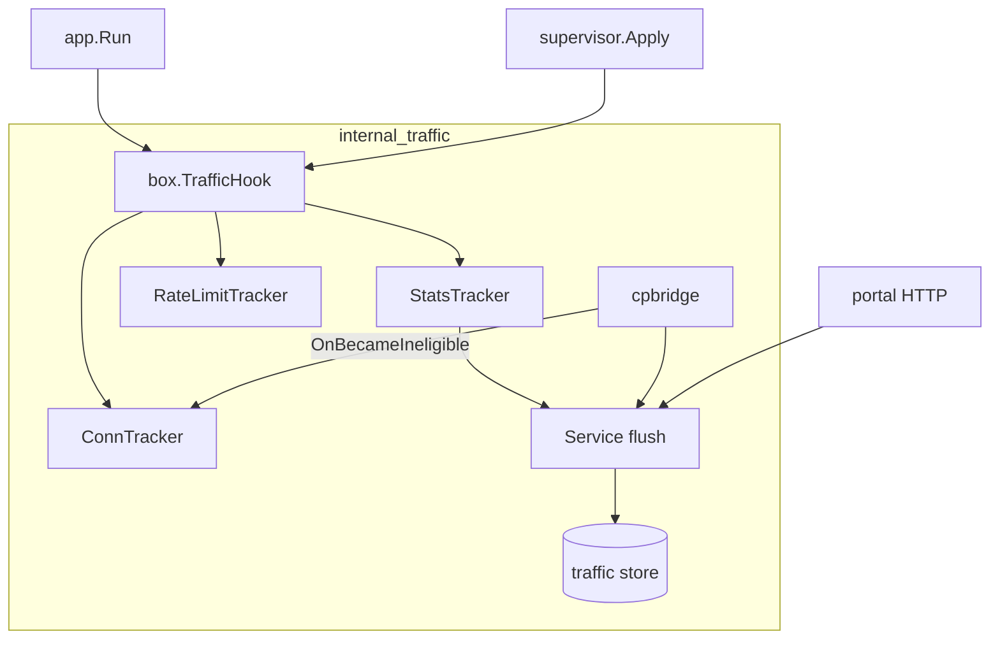

# 03 — Architecture

## Box integration

On `box.Engine.Start`:

1. `singbox.New`
2. `router.AppendTracker` for module trackers (before Start): stats → rate → conn
3. `box.Start`
4. `Hook.OnBoxStarted`

On stop / Apply swap: flush → `OnBoxStopped` → close instance.

When a CP user becomes ineligible, `OnBecameIneligible` closes matching live sessions **before** rematerialize, so traffic stops without waiting for a full box restart (Apply still reloads config carefully to omit creds).

## Package layout

| Path | Role |
|------|------|
| `internal/traffic` | Module entry, Hook, stubs |
| `internal/traffic/domain` | Subject, Sample, Limits |
| `internal/traffic/tracker` | Stats + rate limit trackers |
| `internal/traffic/store` | Cumulative + JSONL series |
| `internal/traffic/service` | Flush, manifest, query |
| `internal/traffic/portal` | HTTP routes |
| `internal/traffic/cpbridge` | CP consumer (`with_traffic && with_controlplane`) |

## Capability matrix

| Mode | Accounting | Shaping |
|------|------------|---------|
| controlplane | subject + inbound/outbound | per-user speed |
| subscribed/direct | auto-discover user + inbound | `PUT /v1/traffic/limits` (dataplane user keys) |
| idle | module idle | n/a |
